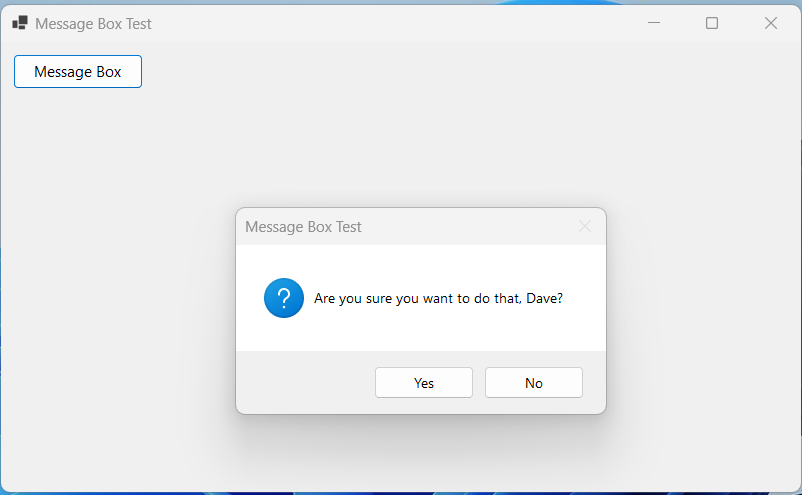
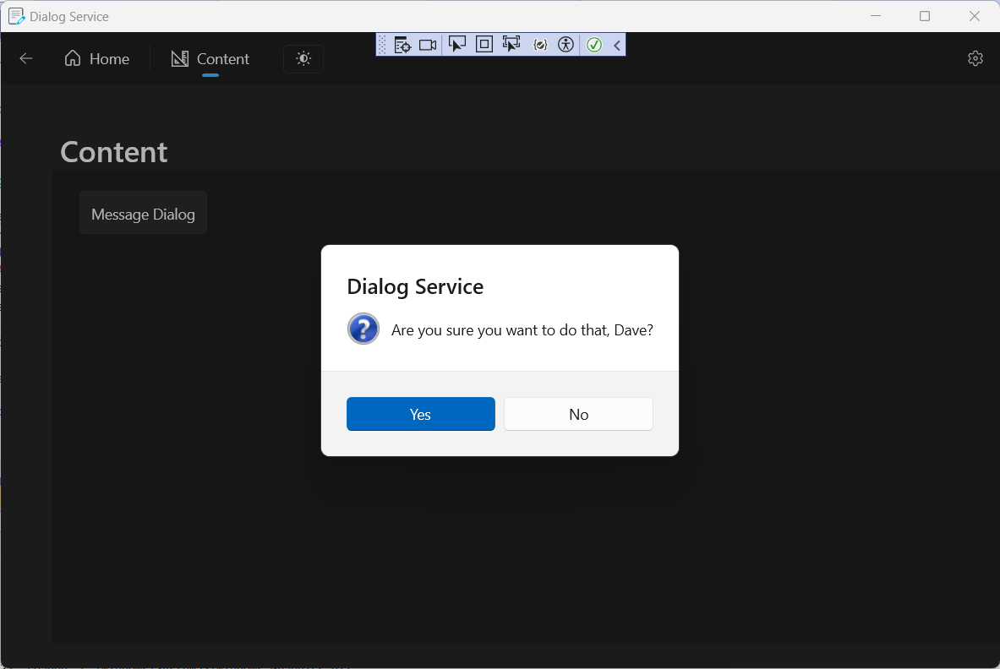
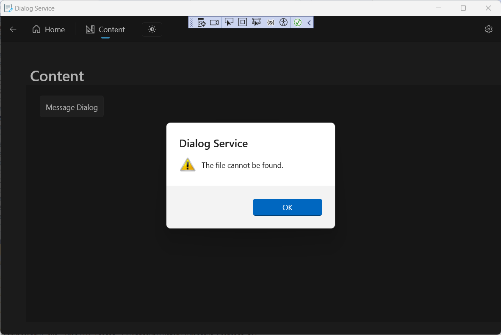

<a name="readme-top"></a>

<!-- PROJECT LOGO -->
<br />
<div align="center">
  <a href="https://github.com/Adam-Gladstone/DialogService">
    
  </a>

  <h3 align="center">DialogService</h3>

  <p align="center">
    <br />
    <a href="https://github.com/Adam-Gladstone/DialogService"><strong>Explore the docs »</strong></a>
    <br />
    <br />
    <a href="https://github.com/Adam-Gladstone/DialogService/issues">Report Bug</a>
    ·
    <a href="https://github.com/Adam-Gladstone/DialogService/issues">Request Feature</a>
  </p>
</div>

<!-- TABLE OF CONTENTS -->
<details>
  <summary>Table of Contents</summary>
  <ol>
    <li>
      <a href="#about-the-project">About The Project</a>
      <ul>
        <li><a href="#built-with">Built With</a></li>
      </ul>
    </li>
    <li>
      <a href="#getting-started">Getting Started</a>
      <ul>
        <li><a href="#prerequisites">Prerequisites</a></li>
        <li><a href="#installation">Installation</a></li>
      </ul>
    </li>
    <li><a href="#usage">Usage</a></li>
    <li><a href="#roadmap">Roadmap</a></li>
    <li><a href="#license">License</a></li>
    <li><a href="#contact">Contact</a></li>
    <li><a href="#acknowledgments">Acknowledgments</a></li>
  </ol>
</details>

<!-- ABOUT THE PROJECT -->
## About The Project
In a previous WinUI 3 project ([WordleWinUI](https://github.com/Adam-Gladstone/Wordle)) I wanted a simple dialog box to display a message to the user. I was rather hoping for an equivalent to the Windows Forms (C#) MessageBox, which is easy to code:

```
  string message = "Are you sure you want to do that, Dave?";
  string caption = "Message Box Test";
  DialogResult result = MessageBox.Show(message, caption, MessageBoxButtons.YesNo, MessageBoxIcon.Question);
  if (result == System.Windows.Forms.DialogResult.Yes) {
      // Open the airlock ...
  }
```

And it produces a functional MessageBox:



This doesn't seem to exist in WinUI 3 (The [MessageDialog class](https://learn.microsoft.com/en-us/uwp/api/windows.ui.popups.messagedialog?view=winrt-22621) seems to be deprecated in WinUI). So I thought it would be a nice idea to develop a reusable widget that worked similarly to the Windows Forms Message Box. Furthermore, I was inspired by [XamlBrewer](https://xamlbrewer.wordpress.com/2022/03/09/a-dialog-service-for-winui-3/). This sounded very similar to what I wanted and I thought it might be a good idea to port this to C++/WinRT as a reusable component. In the end, I simplified the DialogService to a single API call:



The client code is not much more involved than the C# code above:

```
    hstring title = App::Window().Title();

    auto result = co_await DialogServiceWRC::ModalView::MessageDialogAsync(
        winrt::box_value<Windows::Foundation::IInspectable>(*this),
        title,
        L"Are you sure you want to do that, Dave?",
        DialogServiceWRC::MessageBoxButtonType::YesNo,
        DialogServiceWRC::MessageBoxIconType::Question);

    auto dialogResult = winrt::unbox_value<Microsoft::UI::Xaml::Controls::ContentDialogResult>(result);

    if (dialogResult == Microsoft::UI::Xaml::Controls::ContentDialogResult::Primary) {
      // Open the airlock ...      
    }

```

### Project structure
There are three projects in the DialogService.sln solution file:
  * __DialogServiceWRC__ - this is a C++ Windows Runtime Component. 
  * __DialogServiceProjection__ - this is a .NET project to generate the interop ('projection') and package it as a NuGet package.
  * __DialogServiceWinUI__. - this is a standard WinUI 3.0 C++/WinRT Windows Desktop Application that consumes the component.

#### __DialogServiceWRC__
The __DialogServiceWRC__ defines a simple API in ModalView.idl for calling the MessageDialog:

```
  static Windows.Foundation.IAsyncOperation<IInspectable>
    MessageDialogAsync(
      IInspectable value,
      String title,
      String message,
      MessageBoxButtonType buttons,
      MessageBoxIconType icon
    );

```
This API is mostly a simple wrapper around the WinUI 3 ContentDialog control (https://learn.microsoft.com/en-us/windows/windows-app-sdk/api/winrt/microsoft.ui.xaml.controls.contentdialog?view=windows-app-sdk-1.4). However, I wanted to be able to set the buttons and the icons. 
This involved creating some Xaml controls on-the-fly, and adding this to the ContentDialog Content property.
In a previous application (WordleWinUI), the dialog service was part of the main application. The MessageDialogAsync call wrapped a call to the ContentDialog plus some custom XAML to display the MessageBox with the icons. 

However, there were two issues when moving this code to be part of a reusable Windows Runtime Component:
1) The MIDL compiler complained about not knowing the types of `ContentDialogResult` (this is a simple enum `int32`, and which we could work around by creating our own type), and more importantly the `FrameworkElement` which is essential for determining the `XamlRoot`. The header file with the correctly generated types was present. For some reason the MIDL compiler couldn't see it. The solution adopted was to pass both these types as `IInspectable` and **box** and **unbox** them as required. So calling the API requires boxing and unboxing values.

2) A more serious problem arose when I added the XAML page markup to represent the 'inner' message box of the content dialog. Again the MIDL compiler failed with an unhelpful error message. After various failed attempts, the workaround I adopted was to define the MessageBox content entirely in C++/WinRT code. Luckily there was no need for this to be a separate `runtimeclass` as the content is just passed to the ContentDialog container. There was not much markup and all the binding (the icon resource and the message text) could be handled in code. Phew. 

#### __DialogServiceWinUI__
The __DialogServiceWinUI__ consumes the __DialogServiceWRC__. This involves generating the NuGet package (using the projection project), then adding a project reference to this solution and including the generated header file in pch.h: `#include <winrt/DialogServiceWRC.h>`. 

The __DialogServiceWinUI__ exercises the MessageDialog functionality with a simple button in the Content page.



The __DialogServiceWinUI__ also demonstrates a number of additional features
- support for light/dark mode via a toggle button on the menu.
- navigation view with 2 pages and a settings page. This provides a simple extensible framework
- support for application wide and user settings via a simple runtimeclass.
- resizing the app window
- setting the application icon for the main window

<p align="right">(<a href="#readme-top">back to top</a>)</p>

### Built With

* Visual Studio 2022
* C++20
* C++/WinRT
* WinUI 3.0

<p align="right">(<a href="#readme-top">back to top</a>)</p>

<!-- GETTING STARTED -->
## Getting Started

The project can be downloaded from the GitHub repository in the usual way.

### Prerequisites


### Installation


<p align="right">(<a href="#readme-top">back to top</a>)</p>

<!-- USAGE EXAMPLES -->
## Usage


<p align="right">(<a href="#readme-top">back to top</a>)</p>

<!-- ROADMAP -->
## Roadmap

See the [open issues](https://github.com/Adam-Gladstone/DialogService/issues) for a full list of proposed features (and known issues).

<p align="right">(<a href="#readme-top">back to top</a>)</p>

<!-- LICENSE -->
## License

Distributed under the GPL-3.0 License. See `LICENSE.md` for more information.

<p align="right">(<a href="#readme-top">back to top</a>)</p>

<!-- CONTACT -->
## Contact

Adam Gladstone - (https://www.linkedin.com/in/adam-gladstone-b6458b156/)

Project Link: [https://github.com/Adam-Gladstone/DialogService](https://github.com/Adam-Gladstone/DialogService)

<p align="right">(<a href="#readme-top">back to top</a>)</p>

<!-- ACKNOWLEDGMENTS -->
## Acknowledgments

Helpful resources

* [Choose an Open Source License](https://choosealicense.com)
* [Img Shields](https://shields.io)
* [GitHub Pages](https://pages.github.com)
* [Font Awesome](https://fontawesome.com)
* [React Icons](https://react-icons.github.io/react-icons/search)

<p align="right">(<a href="#readme-top">back to top</a>)</p>

<!-- PROJECT SHIELDS -->

[![Issues][issues-shield]][issues-url]
[![GPL-3 License][license-shield]][license-url]
[![LinkedIn][linkedin-shield]][linkedin-url]

<!-- MARKDOWN LINKS & IMAGES -->
<!-- https://www.markdownguide.org/basic-syntax/#reference-style-links -->

[issues-shield]: https://img.shields.io/github/issues/Adam-Gladstone/DialogService.svg?style=for-the-badge
[issues-url]: https://github.com/Adam-Gladstone/DialogService/issues

[license-shield]: https://img.shields.io/github/license/Adam-Gladstone/DialogService.svg?style=for-the-badge
[license-url]: https://github.com/Adam-Gladstone/DialogService/LICENSE.md

[linkedin-shield]: https://img.shields.io/badge/-LinkedIn-black.svg?style=for-the-badge&logo=linkedin&colorB=555
[linkedin-url]: https://www.linkedin.com/in/adam-gladstone-b6458b156/

[product-screenshot]: Images/Screenshot.PNG
